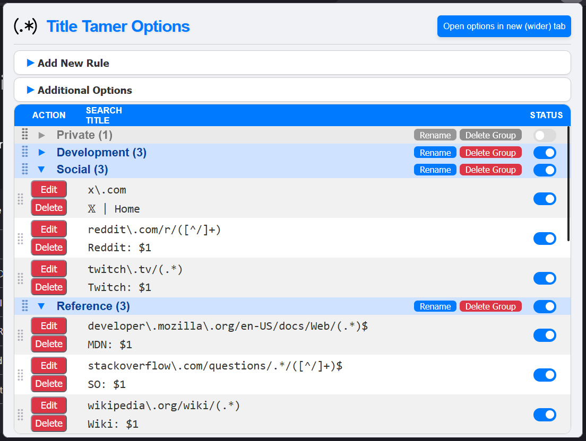
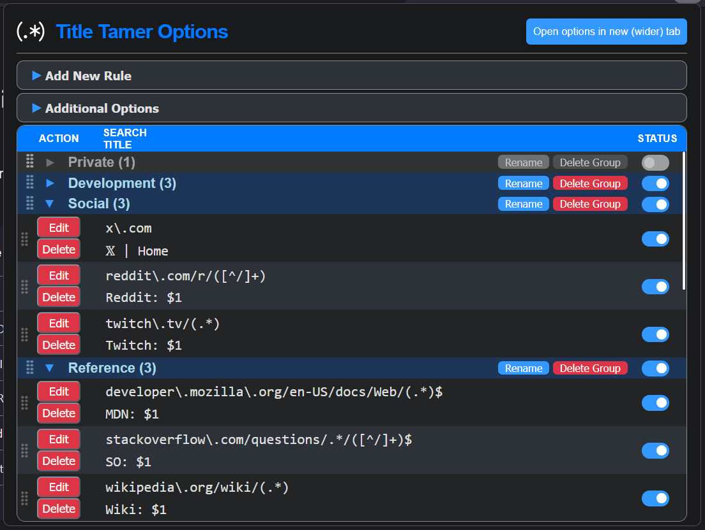
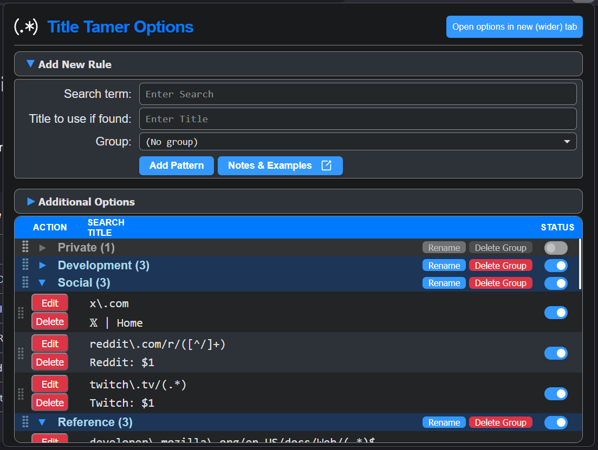
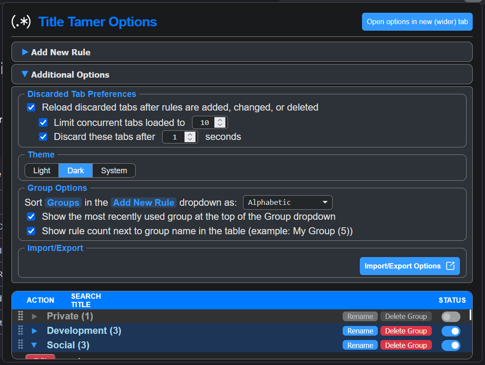

# Title Tamer

  

  
   
  <b>Options Interface — Light Mode</b>

  
   
  <b>Options Interface — Dark Mode</b>

## Features
- Monitor tab URLs and change their titles based on user-defined search patterns.
- **URL Decoding Support**: Automatically decodes percent-encoded characters (like `%20`, `%22`, etc.) within captured URL segments. This ensures that titles like `Search: My%20Query` are rendered as `Search: My Query` in your tab.
- **Advanced RegEx Support**: Full support for JavaScript Regular Expressions, including capture groups and anchors.
- **Real-Time Title Guardian**: Uses a robust in-page `MutationObserver` to instantly re-assert your custom title if a website attempts to overwrite it (fixing "flicker" on SPAs).
- **Developer Diagnostic Tools**: Optional internal logging system to help power users troubleshoot complex matching rules and site-specific behaviors.
- **Special Character Support**: All patterns and titles are escaped to ensure characters like `<`, `>`, and `&` are rendered correctly in the options interface.
- **Rule Grouping System**: Organize patterns into logical groups with collapsible headers, enable/disable toggles that cascade to child rules, and easily rename or delete entire groups.
  

    
     
    <i>Rule Creation and Group Management</i>
  

- **Drag-and-Drop Support**: Reorder individual rules and entire rule groups with full context-aware snapping that allows moving rules between groups.
- **Custom UI Framework**: Modern theme-aware interface with custom dropdowns, a dedicated SVG logo, and HTML5 `<dialog>` modals that replace generic browser alerts.
- **Dynamic Icon Coloring**: Supports Firefox's native `context-properties`, allowing the toolbar icon to perfectly match your browser's theme coloring. When enabled via a browser preference, the icon dynamically adapts its fill and stroke to remain high-contrast and aesthetically integrated with any Firefox theme (Light, Dark, or custom).
- **Intelligent Discard Management**: Configure custom discard delays, prevent infinite loading spinners with anti-throbber fixes, and restore manipulated titles even after extension reloads.
- **Throttled Tab Synchronization**: Uses a rolling worker pool to process discarded tabs in controllable batches (default 10), preventing memory exhaustion and system crashes during large-scale sync operations.
- **Advanced Import/Export**: Easily backup or share your entire pattern collection via JSON files. Install community "Rule Packs" using a smart Append mode that prevents duplicates, or use Replace mode to restore your configuration from a hard backup.
  

    
     
    <i>Advanced Management and Import/Export Settings</i>
  

- **Flexible Management**: Add, delete, update, and reorder patterns in priority order via a dedicated options page with responsive scrolling and auto-scroll features.

## Examples
- https://github.com/irvinm/Title-Tamer/wiki/Examples

## Limitations
- Will not work on browser built-in pages like `about:debugging`, `about:addons`, etc.
- Will not work on Firefox protected domains like `addons.mozilla.org` or `support.mozilla.org`.
- Will not work on Firefox-only "protected" pages (e.g., Reader Mode, PDF Viewer) without explicit user-granted host permissions.
- **Private Browsing**: Extension must be explicitly allowed to run in "Private Windows" via the browser's extension settings.
- **Competing Titles**: While Title Tamer includes a "Guardian" mode to defend your titles, extremely aggressive sites may still cause brief flickering before the override is re-applied.
- **Conflicts**: Other extensions that manage tab titles may conflict with this addon.
- **Loaded State**: A tab must be at least partially loaded before a title rule can be applied (except for discarded tabs handled by the sync engine).
- **OS Truncation**: Very long titles may still be truncated by the operating system's task switcher or the browser's UI.
- Requires host permission for certain pages like reader view, view-source, and PDF viewer pages.
- Title Tamer updates the `document.title` to update the title, and that can only be done with a loaded tab.
- Discarded tabs require a brief wake/reload cycle to apply title changes; this is handled automatically by Title-Tamer's built-in synchronization engine if enabled in options.
- Redirecting sites (logins, etc.) might cause rules to be applied or not.

## Roadmap
- Support for Firefox Sync for pattern synchronization.
- Keyboard shortcuts for quick title management actions.
- Add badge option to show the number of active patterns.
- Support for Firefox and Tree Style Tab (TST) integration for "Rename this tab" context menu.
- Case-insensitivity option for non-regex patterns.

## Debug/Testing
1. Go to [https://regex101.com/](https://regex101.com/)
2. Enable "ECMAScript (JavaScript)" under "FLAVOR" in the left nav bar
3. Enter your pattern in the "REGULAR EXPRESSION" box
4. Enter your test URL in the "TEST STRING" box
5. Ensure your pattern matches the URL as expected

## Development

### Prerequisites
- Node.js (v24+ recommended)
- `web-ext` (installed globally or via `npm`)

### Commands
- `npm install` - Install dependencies
- `npm test` - Run unit tests (Mocha/Chai)
- `npm run lint` - Run extension linter
- `npm run start` - Run extension in development mode
- `npm run build` - Build the extension for release

## Inspiration
- Rename Tab Title - https://addons.mozilla.org/en-US/firefox/addon/rename-tab-title/
- Tab ReTitle - https://addons.mozilla.org/en-US/firefox/addon/tab-retitle/

## Changelog

<b>Version 1.2.0 (April 22, 2026) — Rule Packs & Performance Optimization</b>

- **Advanced Import/Export Options**: 
    - Introduced a dedicated, immersive card-based UI for managing your Title Tamer files.
    - Added new **Append** and **Replace** modes, allowing you to reliably merge imported configurations without losing your current setup.
    - Implemented a smart deduplication engine that automatically drops redundant rules when installing community "Rule Packs."
    - Safely merges group metadata during imports to preserve your group state (collapsed/expanded) settings seamlessly.
    - Added ARIA labeling and Escape key handling for improved accessibility and UX.
- **Theme-Aware Branding**:
    - Introduced a new **Theme-Aware Favicon** that automatically switches between light and dark modes based on your browser's theme.
    - Added support for Firefox **Dynamic Icon Coloring**, allowing the toolbar icon to match your browser's theme colors via `context-properties`.
    - Added a dedicated instruction page (linked from Options) to guide users through enabling the `svg.context-properties.content.enabled` preference in Firefox.
- **XPI Optimization**:
    - Completely restructured the project to isolate production code from development assets.
    - Reduced final XPI size by ~88% (from 680KB down to 80KB) by excluding non-essential documentation and screenshots from the package.

<b>Version 1.1.0 (April 20, 2026) — Hardening & Guardian Update</b>

- **Real-Time Title Guardian**: 
    - Implemented a robust `MutationObserver` system that runs directly in the page context.
    - Instantly re-asserts custom titles if the website attempts to overwrite them (fixes "title fight" on SPAs like Costco, Gmail, or YouTube).
    - Hardened to observe the entire `<head>` subtree, capturing cases where the `<title>` tag itself is replaced.
- **Developer & Diagnostic Tools**:
    - Added a new **"Developer Tools"** section in the Options page.
    - Integrated a toggleable diagnostic logging engine to help troubleshoot complex URL matching and title sync behavior.
    - Improved logging sequence to be deterministic during extension startup and rapid tab events.
- **Sync Engine Hardening**:
    - Unified the "Wake-up" and "Real-time" injection paths to ensure the Guardian is consistently applied to all tabs.
    - Implemented atomic state persistence: modified records are now only saved after a successful title injection, preventing stale internal state on errors.
    - Added explicit guard disconnection during URL changes to prevent lingering observers from interfering with new navigations.
    - Improved error boundaries in the rolling worker pool to provide better diagnostic output for failed operations.

<b>Version 1.0.0 (April 19, 2026)</b>

- **Rule Grouping System**: 
    - Introduced logical grouping for patterns with collapsible group headers.
    - Added "Enable/Disable" toggles for entire groups (states cascade to child rules).
    - Integrated support for renaming and deleting entire rule groups.
    - Preserved group states (expanded/collapsed) and included them in JSON Metadata during export.
- **Advanced Group Options**: 
    - Added configuration for "Rule Counts" indicators next to group names.
    - Added configuration for add Group dropdown order (Alphabetical or Table Order).
    - Added configuration for adding most recently used group to top of dropdown.
- **Drag-and-Drop Support**: 
    - Full drag-and-drop support for reordering both individual rules and entire rule groups.
    - Context-aware snapping that allows moving rules between groups or reordering groups themselves.
- **Custom UI Framework & Branding**: 
    - Added a new application header with a dedicated SVG logo and platform-synced theme icons.
    - Migrated from native browser selects to custom dropdowns to fix high-DPI scaling issues.
    - Replaced generic Javascript `alert()` popups with fully integrated, theme-aware HTML5 `<dialog>` modals.
- **Rule State Machine**: 
    - Completely refactored the background engine to track native vs. modified titles.
    - Enables seamless, real-time title restoration when rules are deleted, disabled, or groups are toggled—no page reloads required.
- **Intelligent Discard Management**:
    - **Custom Discard Delay**: Added support to configure the precise delay time before discarding tabs.
    - **Anti-Throbber Fix**: Automatically executes `window.stop()` before re-discarding tabs to prevent infinite loading spinners in the browser UI.
    - **Throttled Synchronization**: Implemented a "Rolling Worker Pool" that limits concurrent tab reloads (default 10) to prevent memory exhaustion and browser crashes during large-scale syncs (1000+ tabs).
    - **Amnesia Recovery**: Implemented a stateless heuristic that correctly identifies and reverts manipulated titles in discarded tabs even after an extension reload or browser restart.
- **Scroll & UX Polish**: 
    - **Scrolling**: Added overlay scrollbar support and `scrollbar-gutter` logic to prevent layout shifting when the rules table grows.
    - **Auto-Scroll**: Automatically scrolls the active editing row into view to guarantee "last row" visibility during form submission.
    - **Ultra-Compact Layout**: Redesigned the "Additional Options" section with standardized fieldsets and minimized vertical spacing for maximum efficiency.
    - **Segmented Theme Control**: Switched to a unified pill-style toggle for theme selection.
    - **Unified Typography**: Synchronized all input controls to a 13px Monospace font and added high-visibility "pill" highlights for UI terminology.
    - Adjusted the entire layout to use 100% width for full-page responsive viewing.

<b>Version 0.9.4 (Mar 29, 2026)</b>

- **URL Decoding**: Added support for decoding percent-encoded characters in URLs before matching (Issue #7).
- **Display Improvements**: Implemented HTML escaping to ensure special characters in patterns and titles are rendered correctly instead of being interpreted as HTML code.
- **Robust Title Sanitization**: Improved `document.title` handling using JSON serialization to prevent special character corruption.
- **Infrastructure**: Introduced Node.js toolchain, unit testing suite, and GitHub Actions CI/CD.
- **Organization**: Restructured the project to group source files in the `src/` directory.

<b>Version 0.9.3 (Jun 15, 2025)</b>

- Added dark mode support for options popup (https://github.com/irvinm/Title-Tamer/issues/6)
- Cleaned up popup UI a little

<b>Version 0.9.2 (Mar 24, 2025)</b>

- Fixed issue when dealing with dark mode and addon icon under certain conditions. (https://github.com/irvinm/Title-Tamer/issues/5)

<b>Version 0.9.1 (Dec 15, 2024)</b>

- Fixed issue when editing rules that some buttons showed thru the header of the table. (https://github.com/irvinm/Title-Tamer/issues/1)

<b>Version 0.9.0 (Nov 26, 2024)</b>

- Monitor tab URLs and changes the tabs title based on user-defined search patterns.
- Monitor for new tabs, changed URLs, and changed titles.
- Support regular expressions for advanced pattern matching including groups and exact matches.
- Support string searches for substring matches including basic domain matches.
- Option to load and discard tabs when rules are added or edited.
- Import and export patterns for easy sharing and backup.
- Support opening the options in a separate tab for a wider view of your patterns.
- Initial support to add, delete, update, reorder patterns in priority order.

